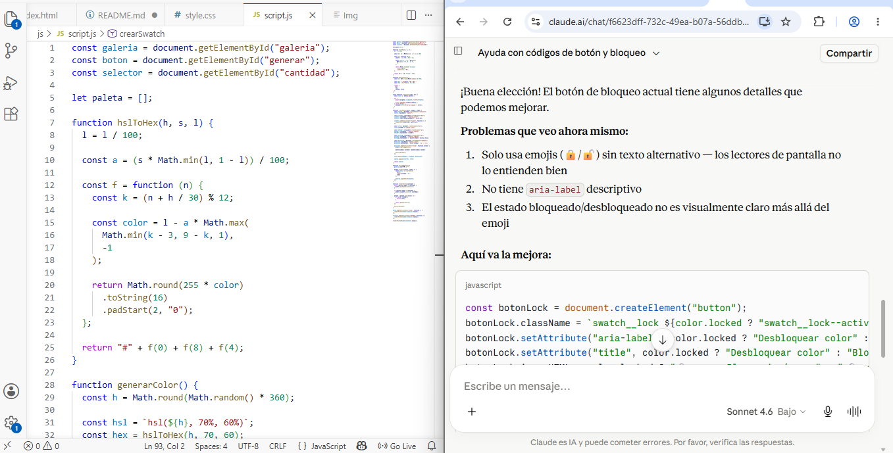
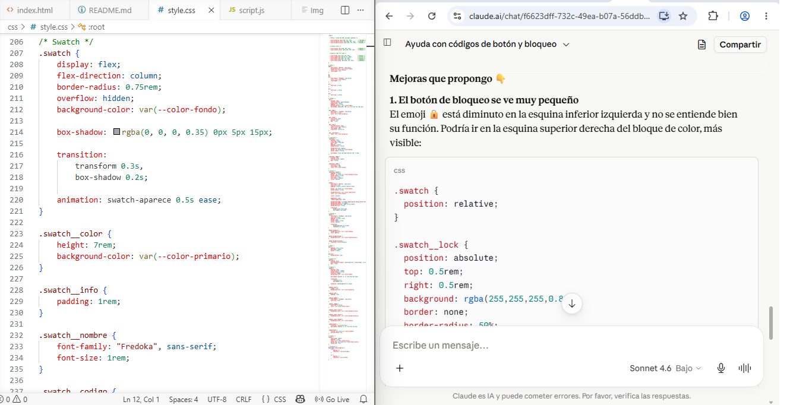
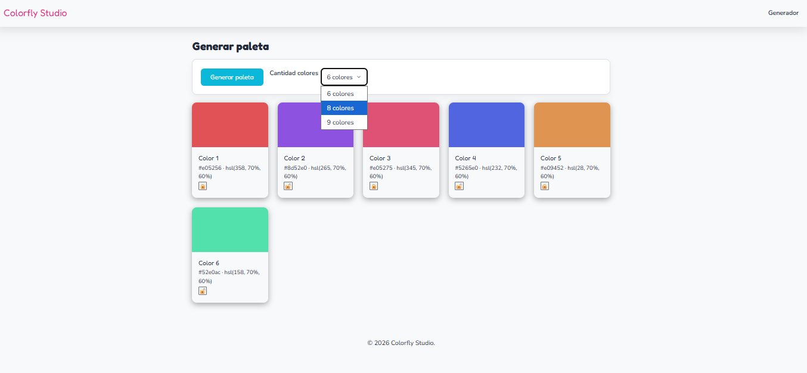

# colorfly studio 🎨
generador de paleta de colores interactico en formato HSL y HEX de forma aleatorias construido con HTML, CSS Y JavaScript.

🔗 **Link del proyecto:**(https://marcelo0585.github.io/ProyectoM1-Alejandro-Marcelo/)
 

## Tecnologias 🛠️
- HTML5 semantico
- CSS3 (Flexbox, Grid, Variables CSS)
- JavaScript (DOM, Eventos, Manipulacion dinamica de elementos)
- Git y GitHub para control de versiones
- Git Hub Pages para despliegue de la pagina

## estructura del proyecto 🎯

```
ProyectoM1-Alejandro-Marcelo/
├── README.md
├── assets/
│   ├── evidencia-ia-1.png
│   ├── evidencia-ia-2.png
│   └── evidencia-ia-3.png
├── css/
│   └── style.css
├── index.html
└── js/
    └── script.js

```
    

## Como usar 🚀
- Abre la aplicación en el navegador (link de la demo arriba)
- Selecciona la cantidad de colores que deseas generar entre (6, 8 o 9) en el menú desplegable
- Haz clic en el botón "Generar Paleta" para crear una nueva paleta aleatoria
- Haz clic en el ícono de copiar sobre cualquier color para copiar su código HEX al portapapeles
- Haz clic en bloquear en el icono del candado para guardar el color creado

## Documentación del uso de IA 🤖

Durante el desarrollo de Colorfly Studio utilicé inteligencia artificial como apoyo para mejorar la estructura del código en HTML, CSS y JavaScript, así como para optimizar la experiencia de usuario.

### Mejoras realizadas con ayuda de IA
#### Sistema de bloqueo de colores
- Se incorporó la función de bloquear colores para conservarlos al generar nuevas paletas.
- Se mejoró la retroalimentación visual mediante iconos y efectos visuales.

#### Copiar códigos de color
- Se implementó la función para copiar códigos HEX al portapapeles.
- Se agregó una confirmación visual para informar al usuario que el color fue copiado correctamente.
### Evidencia del uso de IA

La IA fue utilizada para:
- Resolver dudas de implementación en JavaScript.
- Proponer mejoras de interfaz y experiencia de usuario.
- Documentar funcionalidades implementadas en el proyecto.

### Capturas del proceso






## Autor

**Alejandro marcelo**

**Proyecto M1**
